# Architecture

This document defines the core technical stack NerfexOS is built on. Every later stage (boot, identity, desktop, theming) assumes these decisions and should not silently diverge from them.

---

## Core System & Base Stack

### Display Protocol

- **Wayland**

### Session / Desktop

- **KDE Plasma (Wayland session)**
  - Traditional panel + floating window model (not tiling).
  - Closest match to the existing Garuda base, minimizing unrelated breakage while Garuda-specific branding/config is stripped.
  - Deep native theming support (color schemes, SDDM, Kvantum, GTK bridging) that a more opinionated DE (GNOME) actively resists.

### Compositor

- **KWin** (bundled with Plasma) — avoids assembling a separate standalone compositor + WM stack from scratch.

### Shell Components

Plasma's own panel, launcher, and notification daemon are **disabled** in favor of standalone, text-configured tools layered on top of the Plasma/KWin session:

| Component         | Tool                   |
| :---------------- | :--------------------- |
| **Panel**         | Waybar                 |
| **Launcher**      | Rofi                   |
| **Notifications** | mako (fallback: dunst) |

> **Rationale:** Plain-text, git-trackable config; directly scriptable by `install.sh`; consistent with the project's _"automation over manual configuration"_ and _"reproducibility over one-off tweaks"_ principles. Avoids relying on Plasma's GUI-driven System Settings state, which is harder to reproduce from a fresh install.

### Shell (Login/Interactive)

- **Fish**
  - Chosen over bash/zsh for its modern out-of-the-box feature set (autosuggestions, sane scripting defaults, syntax highlighting) without requiring a plugin framework.

### Terminal Emulator

- **Konsole**
  - Plasma-native, already the current terminal in use — least friction, most familiar.
  - Integrates directly with KDE's color scheme system, so its content colors can be driven by the same Blood Moon tokens as the rest of the desktop rather than a separate theming format.

---

## Look & Feel (Theming Engine)

### Window Decoration Engine

- **Klassy** (AUR: `klassy`)
  - The seamless _"title bar matches content, no visible seam"_ look is a **KWin decoration** concern, not a terminal-specific one. The title bar and window border are drawn by KWin (server-side decoration), independent of whichever app is inside the window. Theming this once, at the KWin level, fixes the seam for every window (Konsole, Dolphin, browser, etc.) instead of requiring a per-app workaround.

Klassy is a maintained Breeze fork purpose-built for this flat/integrated aesthetic:

- Solid title bar color matched exactly to Blood Moon `Background` (`#0F0F10`), no gradient or separate shade from the window content.
- Thin, configurable border width — matches the `design.md` "thin borders" rule.
- Per-button color control, so the accent color (`#B31217`) can be reserved for a single interactive element (e.g., the close button) rather than applied broadly, matching _"accent color only for interactive elements"_.
- Configurable corner radius and spacing.

### Lock Screen

- **KScreenLocker** (KDE default)
  - Customized, not replaced — same QML theming approach as SDDM, so the lock screen and login screen can share visual language (and potentially QML components) instead of being two separate theming efforts.
  - Consistent with the Plymouth $\rightarrow$ SDDM $\rightarrow$ Plasma handoff: lock screen becomes a fourth surface using the same Blood Moon tokens.

### Qt / GTK Bridging

- **Qt: `qt6ct` + Kvantum**
  - `qt6ct` sets the Qt6 style/palette environment so non-Plasma Qt apps don't fall back to a default theme.
  - Kvantum works as the style engine — SVG-based, allowing exact hex-value matches to `design.md` tokens rather than approximating a preset.
- **GTK: Hand-authored GTK3/4 CSS, applied via `nwg-look`**
  - Automatic Qt $\rightarrow$ GTK theme converters exist but only approximate colors, which isn't acceptable given `design.md` specifies exact hex values.
  - A custom `gtk.css` built directly from the Blood Moon tokens guarantees an exact match and stays plain-text/git-trackable.
  - `nwg-look` is used only to apply/switch the theme on Wayland, not as the theme's source of truth.

---

## Boot & Display Management

### Display Manager

- **SDDM**
  - Plasma's native display manager.
  - QML-themeable, so the login screen can be built from the same design tokens as the rest of the system.
  - Clean handoff from Plymouth (boot splash) $\rightarrow$ SDDM (login) $\rightarrow$ Plasma (desktop).

### Init System

- **systemd** (unchanged from Arch default)

### Bootloader

- **systemd-boot**
  - Plain-text config (`/boot/loader/entries/*.conf`), organically versioned in git.
  - Faster and simpler than GRUB.
  - No dual-boot chain-loading required: occasional Windows use happens via a separate USB-connected SSD selected at the UEFI firmware boot-device level.
  - `timeout=0` recommended so the loader is skipped entirely, going straight into the Plymouth boot animation (fits _"darkness is default, minimal"_).

### Boot Splash

- **Plymouth**
  - Carries the actual cinematic/animated visual identity, since the bootloader itself is skipped.
  - Owns the shutdown/reboot animation — must be themed for both directions.

---

## Stack Summary

```mermaid
graph TD
    A[UEFI Firmware] --> B[systemd-boot <br><i>timeout=0, skipped</i>]
    B --> C[Plymouth <br><i>Blood Moon boot animation</i>]
    C --> D[systemd <br><i>init</i>]
    D --> E[SDDM <br><i>Blood Moon login theme, QML</i>]
    E --> F[Plasma Wayland Session + KWin <br><i>Klassy decoration theme</i>]

    F --> F1[Waybar <br><i>panel</i>]
    F --> F2[Rofi <br><i>launcher</i>]
    F --> F3[mako <br><i>notifications</i>]
    F --> F4[Konsole <br><i>terminal</i>]
    F --> F5[KScreenLocker <br><i>lock screen, shares QML</i>]

    style A fill:#1a1a1a,stroke:#333,stroke-width:2px;
    style F fill:#0F0F10,stroke:#B31217,stroke-width:2px;

```

Four themed surfaces share the same Blood Moon tokens end-to-end: **Plymouth**, **SDDM**, **KScreenLocker**, and the **Plasma/Klassy desktop** itself.

---

## Status

All core architecture decisions are resolved. Remaining work is implementation (writing the actual theme files, decoration configs, and `gtk.css`), tracked in `design.md` / theme-specific docs rather than here.
